# Lab 1. 스도쿠 게임 만들기 - Spec Driven Development

## 개요

Kiro IDE의 Spec Driven Development 기능을 활용하여 스도쿠 게임을 만들어 봅니다.
요구사항 정의 → 설계 → 태스크 생성 → 구현까지 체계적으로 진행하는 방법을 배웁니다.

**Let's go!**

---

## Step 1. AWS Builder ID로 로그인

1. Kiro에서 **Login with AWS Builder ID**를 선택합니다. 기본 웹 브라우저로 리다이렉트됩니다.
2. 이메일 주소를 입력하고 **Next**를 선택합니다.
3. 비밀번호를 입력하고 **Sign in**을 선택합니다.
4. **Allow access**를 선택하여 Kiro App을 인증합니다.

---

## Step 2. 프로젝트 열기

1. Kiro App을 처음 열면 **Open a Project** 화면이 표시됩니다. **Open Project**를 클릭합니다.
2. 새 폴더를 생성하고 해당 폴더를 프로젝트로 선택합니다.

---

## Step 3. Steering 문서 생성

Steering 문서를 만들어 AI에게 일관된 지시사항을 전달합니다. 최소한의 정보로 시작하고, 필요에 따라 추가할 수 있습니다.

1. 좌측 Kiro 플러그인 메뉴에서 **Agent Steering** 아래의 **Generate Steering Docs**를 클릭합니다. Kiro가 기본 Steering 문서를 생성하도록 허용합니다.

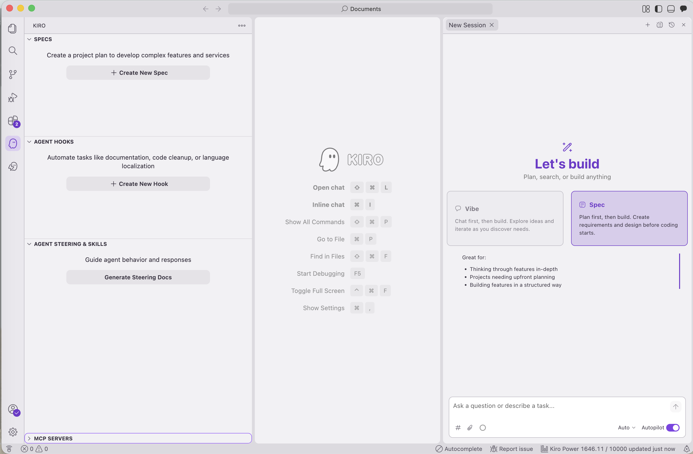

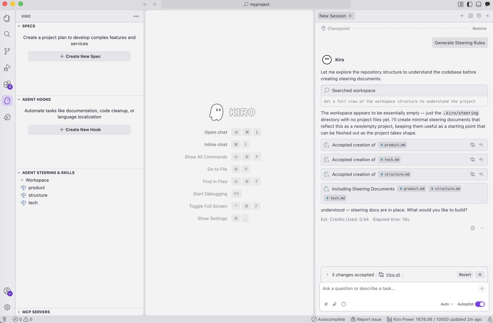

2. Steering 문서는 일반적으로 3개의 파일(tech, product, structure)을 생성합니다.

3. 원하는 규칙을 추가할 수 있습니다. 이 랩에서는 다음 규칙을 프롬프트에 추가합니다.

```
Steering 파일에 다음 내용을 추가해 주세요.
개발 시 프로토타이핑 목적으로 최대한 간결하게 구현해 주세요.
언어는 Python을 기본으로 사용하되, 훨씬 효율적인 대안이 있는 경우에만 다른 언어를 사용해 주세요. Python 패키지 관리는 UV를 사용해 주세요.
응답은 한국어로 작성해 주세요.
```

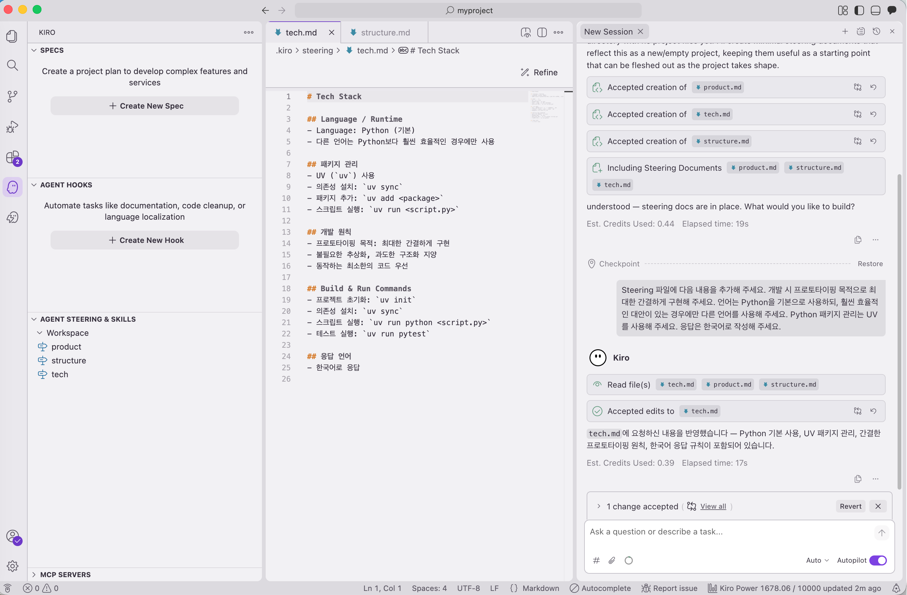

4. 생성된 Steering 문서를 확인하고 평가합니다. 적절하지 않은 부분이 있으면 수정합니다. 만족스러우면 Spec Driven Development를 시작합니다.

---

## Step 4. 요구사항 정의 (Requirements)

채팅창에 프롬프트를 입력하면 `requirements.md` 파일이 생성됩니다.

```
웹에서 쉽게 실행할 수 있는 스도쿠 애플리케이션을 만들어 주세요. 자동 풀기 기능도 추가해 주세요.
```

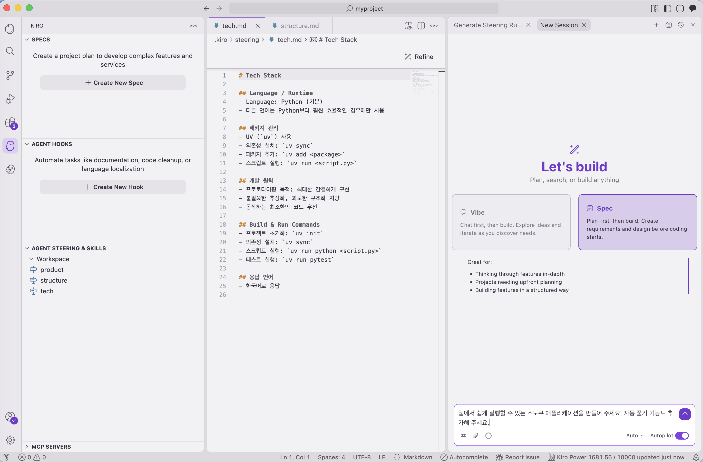

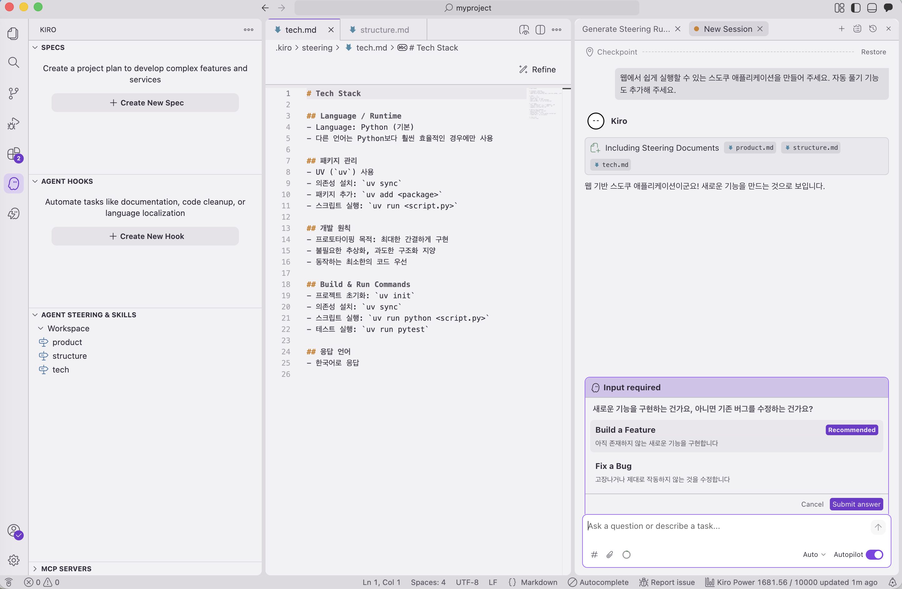

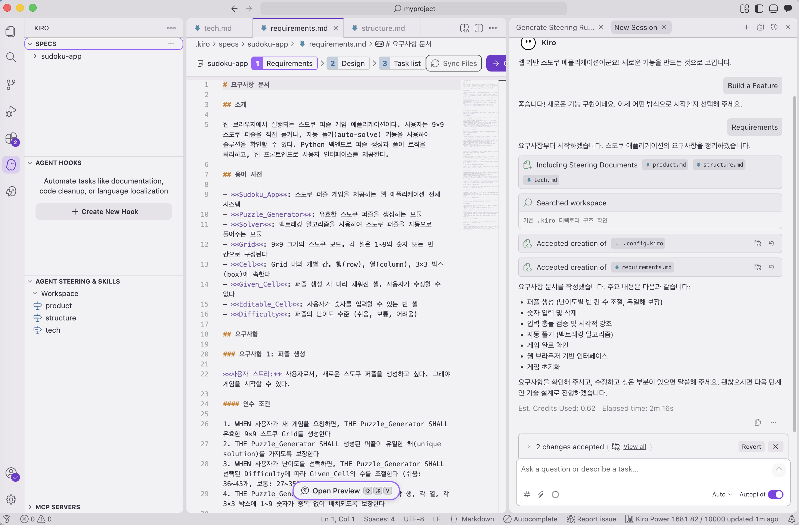

---

## Step 5. 설계 및 태스크 생성

1. 생성된 requirements 파일을 검토합니다.
2. 채팅 패널의 안내에 따라 **design** 파일과 **tasks** 파일을 순서대로 생성합니다.

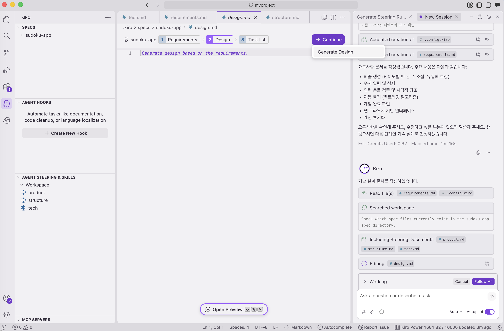
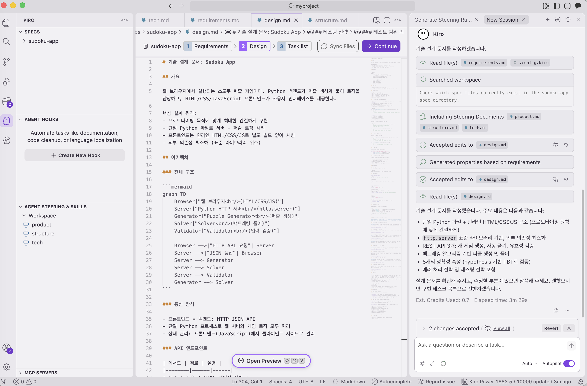

---

## Step 6. 태스크 실행

태스크 생성이 완료되면 **Start Task** 또는 **Run all tasks**를 선택하거나, 채팅창에서 직접 지시할 수 있습니다.

```
태스크 1부터 11까지 실행해 주세요 (선택한 LLM에 따라 생성되는 태스크 수가 다를 수 있습니다)
```

> [!NOTE]
> 선택한 LLM에 따라 생성되는 태스크 수가 다를 수 있습니다.

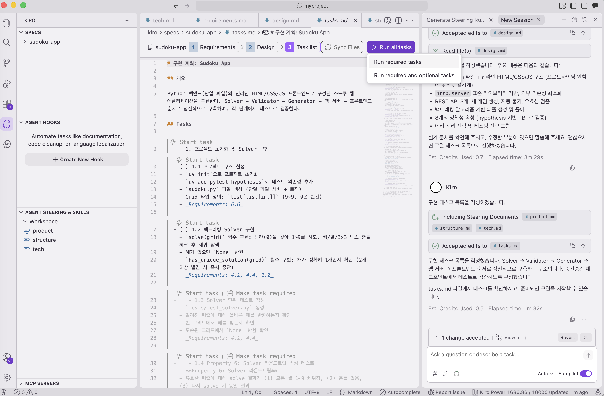

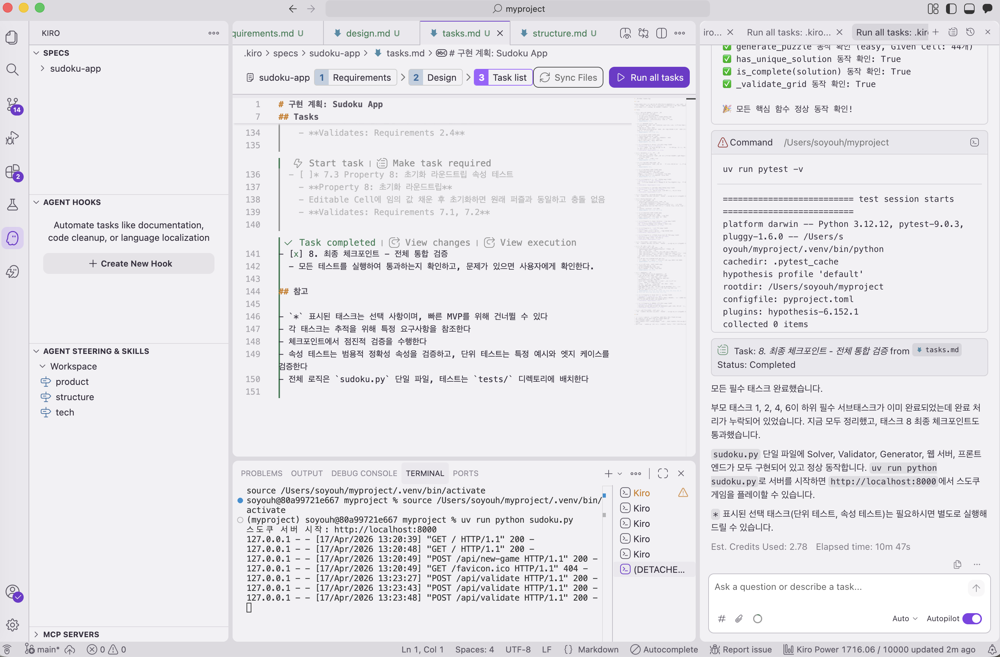

---

## Step 7. 앱 실행

태스크 목록의 일부로 Kiro가 Readme 파일을 생성합니다. Readme의 안내에 따라 앱을 실행하고 스도쿠 게임을 즐겨보세요!

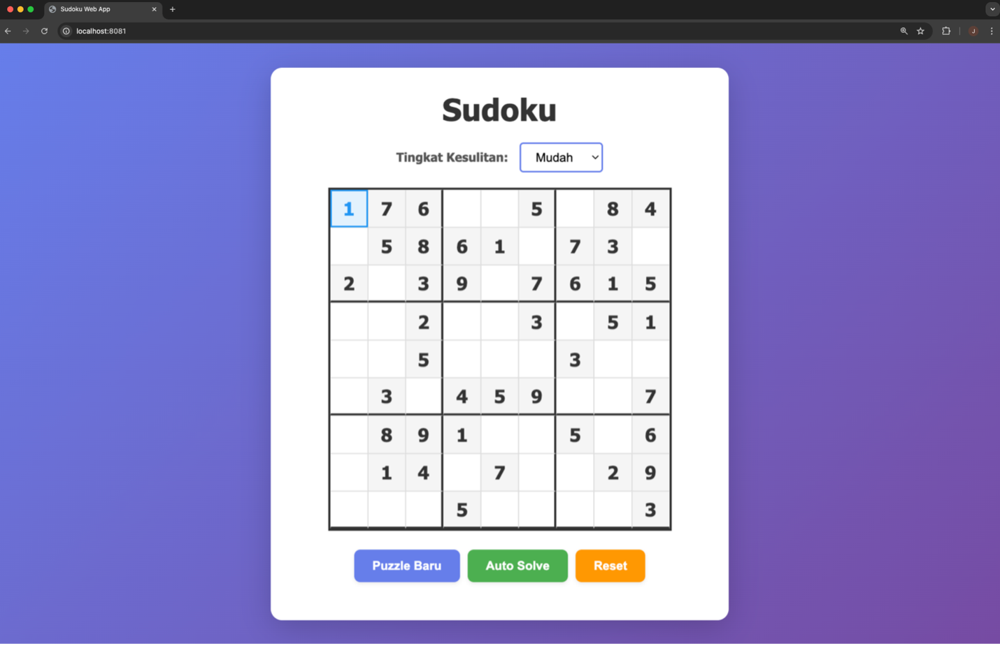

---

🎉 **축하합니다!** Spec Driven Development 기법으로 게임 만들기를 완료했습니다!

---

## 추가 도전 과제 (Optional)

최고 점수 기록 기능 등 추가 기능을 직접 구현해 보세요.
